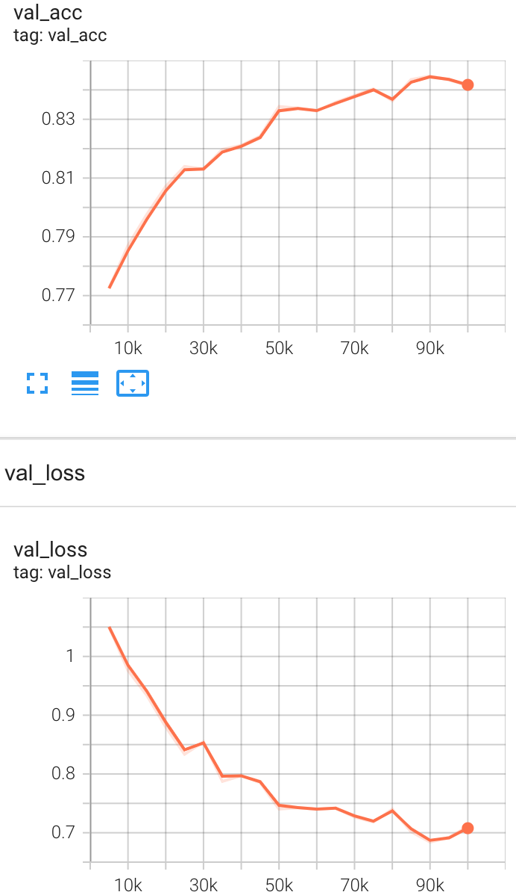
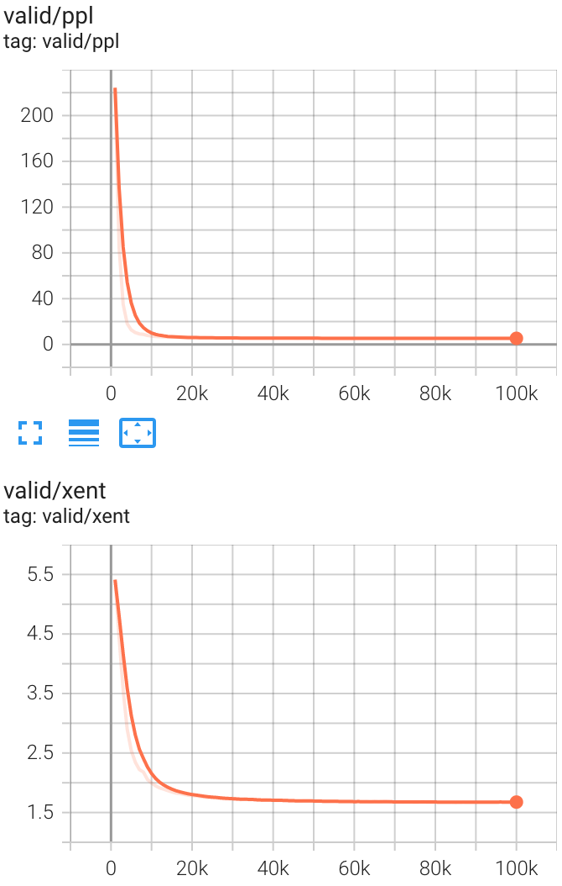
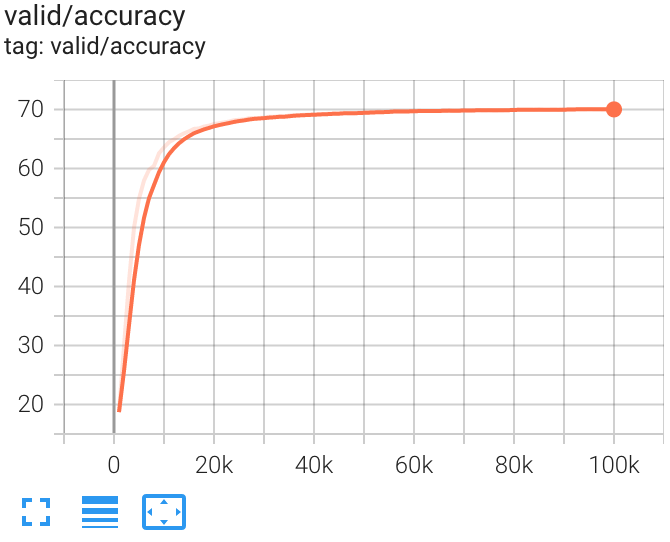

# Distilling BERT for Text Generation 

This is a replication project of an ACL 2020 paper: "[Distilling Knowledge Learned in BERT for Text Generation](https://arxiv.org/abs/1911.03829)".

In this repo the reported experiments are on translation of German to English from IWSLT dataset.

## Methodology overview

The proposed approach consists of three stages: conditional-MLM finetining, extracting the logits from newly trained teacher model, and finally training seq2seq model with knowledge distillation.
1. Conditional-MLM step is training pre-trained BERT on target dataset - German-English translation.
2. Distilling knowledge from frozen finetuned BERT (teacher model) requires to pre-save the logits. 
   This is done in a second stage when top-K options for each training token are pre-computed and saved on the disc. K is equal to 8 across all the experiments.
3. Training a seq2seq encoder-decoder model for translation with the use of distilled knowledge in the loss.


## Implementation details

For the stage 1 and 2 the code in this repo is heavily based on the [original repo](https://github.com/ChenRocks/Distill-BERT-Textgen) released by the authors.  

For all experiments I use one NVIDIA Tesla P100.

### Stage 1:  CMLM finetuning

The authors' implementation is using Docker setup and is expected to run with sudo. I have limited access to the server I work with, and Docker is not installed there. 
Thus, I manually setup a non-docker environment following the Dockerfile to install python packages and other dependencies. I installed newer versions of most of the packages.
Besides, as I learned during installation, NVIDIA/apex used for mixed precision training can not be installed on my server, so I had to skip this step and train in full precision - fp32.

To download and preprocess the data, I had to update the following files: ``scripts/download-iwslt_deen.sh`` and ``scripts/prepare-iwslt_deen.sh``
Update included changing paths for a non-docker run and updating the url for dataset collection, since  the one in authors' repo is not supported anymore, new URL="http://dl.fbaipublicfiles.com/fairseq/data/iwslt14/de-en.tgz".

Due to constraints on available GPU memory, the batch size in my experiments was changed to 8384 (2x decrease from original).

**Results**




### Stage 2: Extracting learned logits from teacher
I extract the knowledge learned by teacher using ``dump_teacher_hiddens.py``. Since my model was trained in full precision, I have to update the linear layer,
so that the scale of the learned weights matches the layer's.

I set top-K to 8 following the paper.


### Stage 3: Training encoder-decoder translation model

**Attempt 1. Using HuggingFace**

Using Hugging Face library to train a transformer encoder-decoder model. Most scripts are located in `opennmt/KD_training`, however, the main training code is in `opennmt/train_HF.py`.
It's located in the opennmt directory only for simplicity for **Attepmt 2** that uses both, see below. 

```
├── opennmt
│   └── KD_training
│       ├── dataset.py
│       ├── loss.py
│       ├── trainer.py
│       ├── utils.py
├── train_HF.py
├── ...
```

The model used in this setting is T5 model, and its architecture is defined via T5Config following all hyperparameters from the paper, such as number of attention heads,
dimensionality of hidden fully connected layer, dropout rate, etc.

When training with knowledge distillation I need to use a custom loss that has access not only to inputs and outputs of the model, 
but to the entire dataset batch where top-k bert logits are stored. There is a need in a custom dataset (without a standard 
interface of returned outputs) and a custom loss. According to the HF Trainer interface I have to rewrite the `compute_loss` function and the entire training step.

*In progress. No results are available*


**Attempt 2. Using HuggingFace + OpenNMT**

To avoid re-writing the HF trainer, I prepared scripts for running HF T5 model with OpenNMT trainer. 
Code available: ``opennmt/train_HF_onmt.py``

*In progress. No results are available*


**Attempt 3. OpenNMT**

Following the official implementation I run the training using OpenNMT trainer and transformer model.

```angular2html
python opennmt/train.py --bert_kd --bert_dump KD_dataset/dump/de-en/targets/BERT-deen --data_db KD_dataset/dump/de-en/DEEN.db -data KD_dataset/dump/de-en/DEEN -config opennmt/config/config-transformer-base-mt-deen.yml \  
    -learning_rate 2.0 -warmup_steps 8000  --kd_alpha 0.5  \
    --kd_temperature 10.0 --kd_topk 8 --train_steps 100000 -save_model output/kd-onmt
```

**Results**



[comment]: <> (![Losses]&#40;figures/translation-losses.png&#41;)



[comment]: <> (![Validation Accuracy]&#40;figures/translation-accuracy.png&#41;)

